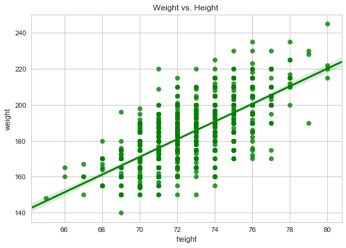
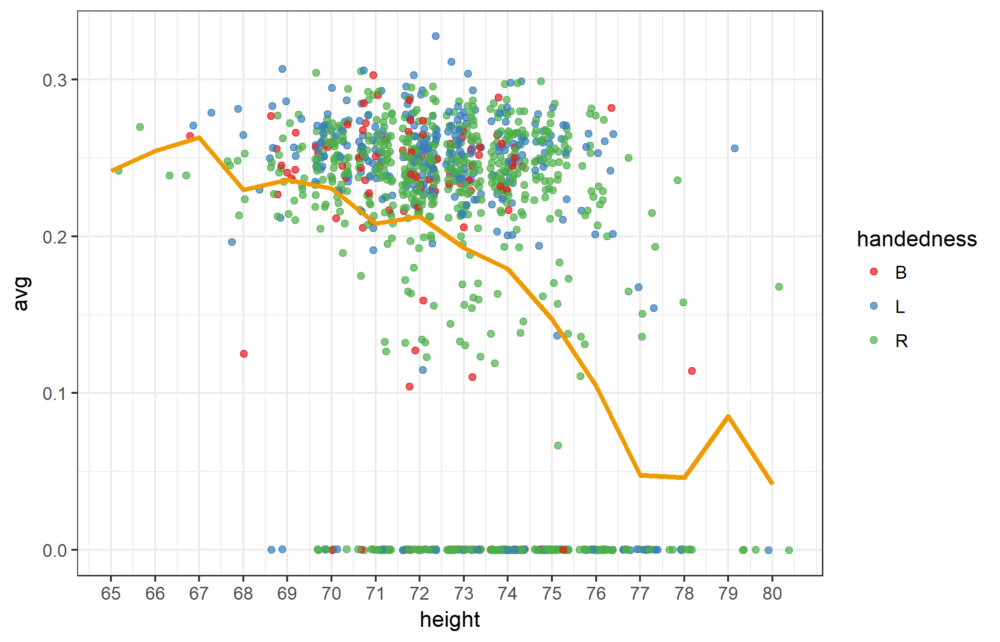
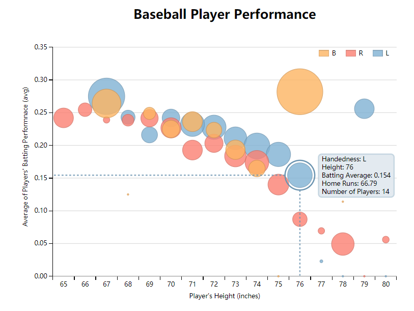

# Project 6: Make Effective Data Visualization
## Baseball Player Performance

### Summary
In this project, we designed and created exploratory data visualization to analyze how determinant factors that effect baseball players' performance. Dataset contains performance and biographical information of 1,157 baseball players and the variables are handedness (left, right or both handed), height (in inches), weight (in pounds), batting average(avg), and number of home runs(HR).  The dataset is derived by doing a random sampling from the Lahman Baseball Database which contains 13238 players who stopped playing before the year 1994 (full [Lahman Baseball Database](http://www.seanlahman.com/baseball-archive/statistics/) and a [detailed description](http://seanlahman.com/files/database/readme2016.txt)). 

### Design 

Players performance is measured by the batting average and number of home runs, and determinant factors are handedness, height and weight. Since height and weight are positively correlated(see figure below), we will use height and handedness as explanatory variables, batting average and number of home runs as response variables. 

In order to see the correlations and trends for given variables, we use R and Python to perform exploratory analysis and generate data visualization plots. The scatter plot shows that most players(97%) are 69 to 77 inches tall, and the mean of batting average (orange line) decreases over height.

To improve the initial exploratory data visualization, we decided to create a bubble chart by implementing D3.js and Dimple.js. We grouped players by height and handedness, so that each circle in chart represents group of players with same height (x-axis) and handedness(color). The y-coordinate of  the center of circle represents the aggregated mean Batting Average for particular group, and meanwhile size of circle denotes the average number of home runs.

This initial version of visualization can be viewed at 
[ first version]("bl.ocks.org/nanli-7/49b4049c1db436ccb4c0c00822b9ef5a") gist page or below: 

### Feedback
Collected feedbacks and comments are listed below: 

**Feedback-1**  
What is the meaning of the circle size?  
The legend bar has already labels players' handedness, if the tooltip also lists handedness, it seems a little duplicated. 
Would be better to add a trend line to show batting average changes over height? 
Players at same height, on average left-handed players have better performance than right-handed players. tallest players are left-handed. 

**Feedback-2** 
A little confusing of the meaning of y-axis label. 
Is it possible to show different handedness groups separately, so that will see the trend more clearly.  
A giant yellow circle at height 76, but it seems an outlier, as there is only one player in this group, it deviates the trend and the size of the circle is largest.

**Feedback-3** 
Overall the batting average is less than 0.3 for all groups. 
What does 'B','L','R' in legend bar represent? 
What is the height distribution for all players, the number of players may effect the average performance, as the more data we have the more significant it will be.  

**Post-feedback Design**

By reviewing the comments and feedbacks, we decided to improve the visualization chart by adding a click-on event for each handedness group, so that one can view different groups separately. We also added some explanatory text under header, changed the labels in tooltip display, etc. However we chose not to link the batting average(center of circle) by adding trend lines, as there are some outliers at the higher end which deviated the circle trend, in that case linked lines may not present the trend well.

Below is the final version of the data visualization and gist page can be viewed at [final design]("https://bl.ocks.org/nanli-7/f994e8a3f60e184462cf9ee4ad5cd78b) 

We also collected feedbacks on final version,

**Feedback** 
How about use circle size/area to represent play number?  
Adjust X-coordinate ticks align with the numbers/labels. 
Use full label title in legend (left, right, both).  
There is some over-lapping between some circles, would be helpful to add a zoom-in function to show details of the circle? 

**Reflections**

Findings from the data visualization:    Left-handed players are better batting and doing home runs. Need to note that the values at both ends (taller or shorter players) may be biased due to limited sample size.

Additional Ideas:   
To improve the data visualization, we can consider to add a bar chart at the bottom to illustrate the player number distribution over height, or change the circle size to player number. We can also further polish the legend bar and axis labels. 

### Resources

[dimple.js - Documentation on Github](https://github.com/PMSI-AlignAlytics/dimple) 
[dimple.js - Interactive Legend](http://dimplejs.org/advanced_examples_viewer.html?id=advanced_interactive_legends) 
[dimple.js - Bubbles Horizontal lollipop](http://dimplejs.org/examples_viewer.html?id=bubbles_horizontal_lollipop) 
[Stack Overflow Post](https://stackoverflow.com/questions/32126615/nested-json-objects-with-dimple-js )  
